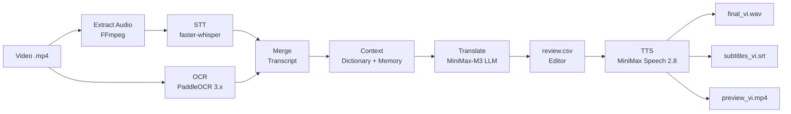

# 🇻🇳 VietDub

> CLI ưu tiên Windows để tạo bản lồng tiếng tiếng Việt từ video hoạt hình / tiểu phẩm tiếng Trung có phụ đề cứng — tự động từ tách âm, STT, OCR, dịch LLM đến TTS và mux video preview.

[](https://github.com/NiTz130/viethoaphim/actions/workflows/test.yml)
[](https://github.com/NiTz130/viethoaphim/actions/workflows/integration.yml)
[](https://github.com/NiTz130/viethoaphim/actions/workflows/ocr-diff.yml)
[](https://www.python.org/downloads/)
[](#cài-đặt)
[](LICENSE)
[](.pre-commit-config.yaml)

---

## ✨ Tính năng chính

| Module | Mô tả |
|---|---|
| 🎬 **Media** | Trích xuất audio từ `.mp4` bằng FFmpeg, chuẩn hóa về 44.1 kHz. |
| 🗣️ **STT** | Nhận diện lời thoại tiếng Trung bằng `faster-whisper` (tự fallback CPU nếu GPU lỗi). |
| 🔍 **OCR** | Đọc phụ đề cứng bằng **PaddleOCR 3.x** trên vùng dưới khung hình. |
| 🧩 **Merge** | Trộn kết quả STT + OCR thành transcript theo mốc thời gian. |
| 🧠 **Translate** | Gọi LLM **MiniMax-M3** (Anthropic-compatible) để dịch sang tiếng Việt, có từ điển & bộ nhớ dịch thuật. |
| 📝 **Review CSV** | Xuất `review.csv` UTF-8 BOM — mở bằng Excel, sửa cột `text_vi` / `status`. |
| 🔁 **Resume** | Resume từ bước TTS sau khi biên tập, không cần chạy lại từ đầu. |
| 🔊 **TTS** | Tạo MP3 từng câu bằng **MiniMax Speech 2.8**, ghép thành `final_vi.wav`. |
| 🎞️ **Render** | Xuất `subtitles_vi.srt` và mux `preview_vi.mp4`. |
| 🧪 **Regression** | OCR regression harness so sánh output giữa các stack ML. |

---

## 🏗️ Kiến trúc



**Pipeline state machine** — mỗi bước ghi `status.json`, cho phép resume từ bất kỳ đâu:

```
extract → stt → ocr → merge → context → translate → (review) → tts → render
```

---

## 📑 Mục lục

- [Yêu cầu](#-yêu-cầu)
- [Cài đặt](#-cài-đặt)
- [Cấu hình](#-cấu-hình)
- [Sử dụng nhanh](#-sử-dụng-nhanh)
- [Cấu trúc job](#-cấu-trúc-job)
- [Dữ liệu tham chiếu & bộ nhớ](#-dữ-liệu-tham-chiếu--bộ-nhớ)
- [Recovery & Maintenance Scripts](#-recovery--maintenance-scripts)
- [Known Issues & Fixes](#-known-issues--fixes)
- [Test & OCR Regression](#-test--ocr-regression)
- [Rollback](#-rollback)
- [Đóng góp](CONTRIBUTING.md)
- [License](LICENSE)

---

## 📋 Yêu cầu

- **Python** 3.11 trở lên (Windows PowerShell được khuyến nghị).
- **FFmpeg** & **FFprobe** trong `PATH`.
- **VC++ 2019/2022 Runtime** (Windows, kiểm tra bằng `setup.ps1`).
- Internet để gọi MiniMax LLM/TTS và tải model OCR/STT lần đầu.
- **MiniMax API key** từ [platform.minimax.io](https://platform.minimax.io).

Kiểm tra nhanh:

```powershell
python --version        # phải ≥ 3.11
ffmpeg -version
ffprobe -version
```

---

## 🚀 Cài đặt

### Windows (PowerShell)

```powershell
git clone https://github.com/NiTz130/viethoaphim.git
cd viethoaphim
.\setup.ps1
```

`setup.ps1` kiểm tra Python 3.11+, kiến trúc AMD64, VC++ runtime, sau đó tạo `.venv/` và cài dependencies. Re-run là no-op nếu `pyproject.toml` không đổi.

### Linux / macOS / CI

```bash
git clone https://github.com/NiTz130/viethoaphim.git
cd viethoaphim
make setup        # tạo .venv/ + pip install -e .
```

### Bootstrap từ scratch

Nếu `.venv/` bị hỏng hoặc `pyproject.toml` thay đổi:

```powershell
Remove-Item -Recurse -Force .venv
.\setup.ps1
```

---

## ⚙️ Cấu hình

Có thể set biến môi trường trực tiếp trong PowerShell hoặc tạo file `.env` ở thư mục gốc repo (không commit).

Tối thiểu:

```powershell
$env:ANTHROPIC_API_KEY="sk-..."
$env:LLM_MODEL="MiniMax-M3"
$env:ANTHROPIC_BASE_URL="https://api.minimax.io/anthropic"
$env:TTS_VOICE_ID="vi-female-1"
```

Ví dụ file `.env`:

```dotenv
# MiniMax (LLM + TTS) — https://platform.minimax.io
ANTHROPIC_API_KEY=sk-...
LLM_MODEL=MiniMax-M3
ANTHROPIC_BASE_URL=https://api.minimax.io/anthropic

# MiniMax TTS — voice_id: https://platform.minimax.io/faq/system-voice-id
TTS_API_KEY=sk-...
TTS_VOICE_ID=vi-female-1
TTS_MODEL=speech-2.8-hd
TTS_BASE_URL=https://api.minimax.io/v1

STT_MODEL=medium
STT_LANGUAGE=zh
JOBS_DIR=jobs
REFERENCE_DATA_DIR=data
SAMPLE_RATE=44100
```

> **Lưu ý:** `LLM_MODEL` mặc định `MiniMax-M3` và `TTS_VOICE_ID` mặc định `vi-VN-HoaiMyNeural` (tên edge_tts cũ) sẽ **fail** ở lần gọi TTS đầu tiên. Phải set sang `voice_id` MiniMax hợp lệ trước khi chạy TTS.

---

## ⚡ Sử dụng nhanh

```powershell
# Kích hoạt venv
.\.venv\Scripts\Activate.ps1

# Chạy review (dừng ở review.csv để sửa thủ công)
vietdub run .\sample.mp4 --mode review --series "sample-series"

# Sau khi sửa review.csv, resume từ TTS
vietdub resume .\jobs\<job-name> --from tts

# Hoặc chạy auto (không dừng)
vietdub run .\sample.mp4 --mode auto --series "sample-series"

# Xem trạng thái job
vietdub inspect .\jobs\<job-name>
```

Output chính:

```text
jobs\<job-name>\output\subtitles_vi.srt
jobs\<job-name>\tts\segments\*.mp3
jobs\<job-name>\tts\final_vi.wav
jobs\<job-name>\tts\sync_report.json
jobs\<job-name>\output\preview_vi.mp4
```

---

## 📂 Cấu trúc job

Mỗi job copy video đầu vào thành `input.mp4` và tạo các thư mục:

```text
audio\original.wav
stt\segments.json
ocr\subtitles.json
transcript\merged.json
context\*.json
translation\translated.json
translation\review.csv
tts\segments\*.mp3
tts\final_vi.wav
tts\sync_report.json
output\subtitles_vi.srt
output\preview_vi.mp4
status.json
job.json
```

`status.json` ghi lại các bước đã xong: `extract`, `stt`, `ocr`, `merge`, `context`, `translate`, `tts`, `render`.

---

## 🧠 Dữ liệu tham chiếu & bộ nhớ

Repo có sẵn `data\Data của thtgiang (đọc README)` gồm các file từ điển (`Names.txt`, `Pronouns.txt`, `VietPhrase.txt`) và `Dictionaries.config`. Khi dịch, VietDub:

- Đọc các mục từ điển có xuất hiện trong transcript hiện tại.
- Quét các job cũ trong `jobs/` để lấy ví dụ dịch, nhân vật và glossary.
- Ưu tiên dòng `reviewed` trong `review.csv`, sau đó đến dòng có `text_vi`, cuối cùng là `translated.json`.
- Ghi các file ngữ cảnh vào `jobs\<job-name>\context\` gồm: `system_memory.json`, `translation_examples.json`, `characters.json`, `glossary.json`, `reference_context.json`.

Job hiện tại được loại khỏi quá trình quét bộ nhớ để tránh tự học lại kết quả của chính nó.

---

## 🛠️ Recovery & Maintenance Scripts

Một số script trong `scripts/` để xử lý các tình huống đặc biệt sau khi job đã chạy:

| Script | Mục đích |
|---|---|
| `dedupe_merged.py` | Gộp các đoạn transcript liên tiếp có cùng `text` để fix lỗi TTS nói lặp 4-5 lần cùng 1 câu. Sau khi chạy, dùng `vietdub resume <job> --from tts`. |
| `recover_translate.py` | Re-run LLM translate cho 1 job đã fail ở bước translate. Fallback `[CHƯA DỊCH] <text_cn>` cho câu LLM vẫn fail. |
| `rewrite_review_csv.py` | Regenerate `review.csv` từ `translated.json` + `merged.json` qua `export_review_csv()` chính thức. |
| `skip_fallback_rows.py` | Đặt `status=skip` cho các dòng có `text_vi` bắt đầu bằng `[CHƯA DỊCH]`. |
| `fix_csv_double_bom.py` | Sửa `review.csv` bị double UTF-8 BOM. |
| `find_duplicates.py` | Debug: in ra các segment overlap/duplicate text trong `merged.json`. |
| `check_first_segments.py` | Debug: in 20 segment đầu + thống kê overlap/duplicate. |
| `verify_final.py` | Verify `preview_vi.mp4`: duration, sync_report, SRT overlap, audio header. |
| `inspect_csv.py` | Debug: in row đầu của `review.csv` + test re-import. |
| `sample_translations.py` | Debug: in 10 bản dịch đầu + đếm fallback rows. |

Ví dụ workflow khi TTS bị lặp câu:

```powershell
.venv\Scripts\python.exe scripts\dedupe_merged.py 'jobs\Tập 1-9'
.venv\Scripts\vietdub.exe resume 'jobs\Tập 1-9' --from tts
```

---

## 🐛 Known Issues & Fixes

- **TTS nói lặp 4-5 lần cùng 1 câu** — `merge_segments` giữ tất cả OCR sample (mỗi 0.5s) của cùng 1 subtitle. Fix: chạy `dedupe_merged.py` rồi resume `--from tts`. Đã reproduce trên `Tập 1.mp4`: 617 → 280 segments (-55%).
- **LLM translate fail vì response thiếu `text_vi`** — MiniMax-M3 thỉnh thoảng trả về item không có field `text_vi`. Hiện không có auto-retry; chạy `recover_translate.py` để re-translate với fallback.
- **Windows console cp1252 không in được tiếng Việt** — chạy với `$env:PYTHONIOENCODING='utf-8'` trước.

---

## 🧪 Test & OCR Regression

Chạy test từ thư mục gốc repo:

```powershell
pytest
```

Manual test nhanh:

```powershell
python -m pip install -e ".[dev]"
vietdub run .\sample.mp4 --mode review --series sample-series
vietdub resume .\jobs\sample --from tts
```

Chi tiết manual test nằm trong [`docs\manual-test.md`](docs/manual-test.md).

### OCR Regression Testing

So sánh OCR output giữa các dependency stack:

```bash
make ocr-diff            # dùng baseline mặc định (jobs/Tập 1-5/ocr/subtitles.json)
make ocr-baseline CONFIRM=overwrite   # ghi đè baseline (cần review)
```

5 metrics: `segment count delta`, `mean text length delta`, `time-range IoU`, `text similarity`, `unmatched %`. Thresholds trong `tests/fixtures/diff_thresholds.json`.

| Exit code | Ý nghĩa |
|---|---|
| `0` | pass |
| `1` | regression (block PR) |
| `2` | missing input |
| `3` | OCR raised |
| `5` | env broken |

---

## ⏪ Rollback

Nếu gặp regression do gitleaks infra (Spec 1) gây CI pain:

```powershell
git revert 12a2139
```

Nếu gặp regression sau cutover NumPy 2.x / paddlepaddle 3.x:

```powershell
git revert bcfc258                 # khôi phục pyproject.toml + requirements-ocr.txt
Remove-Item -Recurse -Force .venv, .venv-2026
pip uninstall vietdub -y
.\setup.ps1                        # bootstrap lại với stack cũ
```

Hoặc pin tạm thời không revert:

```powershell
pip install "numpy<2" "paddlepaddle<3"
```

---

## 📜 License

Dự án phát hành dưới [MIT License](LICENSE) — xem file `LICENSE` để biết chi tiết.

## 🤝 Đóng góp

Đọc [CONTRIBUTING.md](CONTRIBUTING.md) trước khi mở issue / pull request.

## 👤 Tác giả

**Nguyễn Lê Đức Bình** ([@NiTz130](https://github.com/NiTz130))
